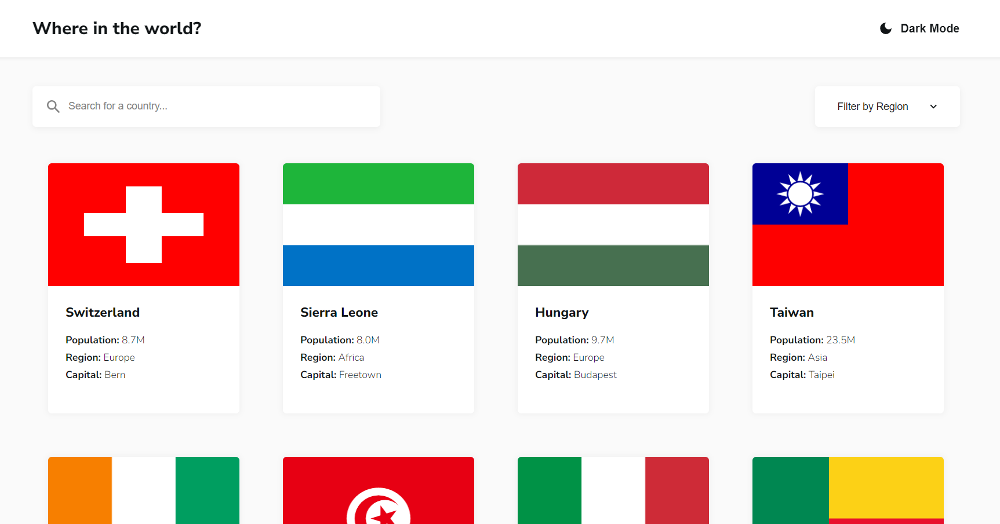

# Frontend Mentor - REST Countries API with color theme switcher solution

## Project overview

Users can to:

- See all countries from the API on the homepage
- Search for a country using an `input` field
- Filter countries by region
- Click on a country to see more detailed information on a separate page
- Click through to the border countries on the detail page
- Toggle the color scheme between light and dark mode

## Screenshot

## Links

- Solution URL: [https://github.com/levansarishvili/rest-countries-api](https://github.com/levansarishvili/rest-countries-api)
- Live Site URL: [https://levansarishvili.github.io/rest-countries-api/index.html](https://levansarishvili.github.io/rest-countries-api/index.html)

## Built with

- Semantic HTML5 markup
- CSS custom properties
- Flexbox
- CSS Grid
- Desktop-first workflow
- Javascript ES6
- Rest Countries API

## Author

- Linkedin: [https://www.linkedin.com/in/levan-sarishvili-b87245b1/](https://www.linkedin.com/in/levan-sarishvili-b87245b1/)
- Github: [https://github.com/levansarishvili](https://github.com/levansarishvili)
- Portfolio: [https://levansarishvili.github.io/my-cv/](https://levansarishvili.github.io/my-cv/)
